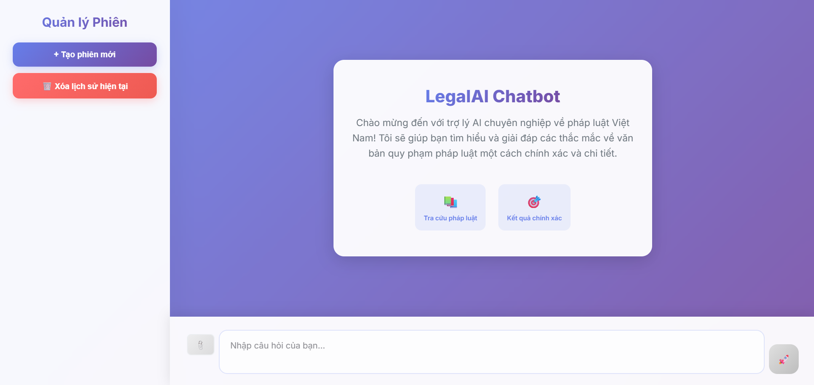

# 📚 LegalAIChatbot

[](https://www.python.org/downloads/release/python-3126/)
[](https://flask.palletsprojects.com/) 
[](https://www.langchain.com/) 
[](LICENSE)

**LegalAIChatbot** là một hệ thống hỏi – đáp văn bản pháp luật tiếng Việt dựa trên phương pháp **Retrieval-Augmented Generation (RAG)**. Người dùng có thể tải lên file PDF (văn bản pháp luật) và hệ thống sẽ trích xuất metadata, lưu tài liệu dưới dạng embeddings, hoặc truy vấn trực tiếp vào kho tri thức của hệ thống, rồi trả lời câu hỏi một cách chính xác và có trích dẫn.

---

## 🖼️ Giao diện hệ thống

<p align="center">
  
</p>

---

## 🚀 Tính năng nổi bật

- **Upload PDF**: Hỗ trợ trích xuất metadata tự động (ngày ban hành, người ký, số hiệu, …).
- **Vector Embeddings + ChromaDB**: Sử dụng embedding model (Google Generative Embeddings), lưu vào Chroma database để truy vấn nhanh.
- **Hybrid Search (Semantic + BM25)**: Tăng độ chính xác trả lời bằng kết hợp tìm kiếm ngữ nghĩa và từ khóa.
- **Hỏi đáp theo ngữ cảnh**: Trả lời chính xác với trích dẫn nguồn, ngày ban hành, người ký.
- **Quản lý nhiều cuộc trò chuyện (sessions)**: Cho phép tạo, xóa, đổi tên, chuyển đổi giữa các phiên hỏi đáp dễ dàng.

---

## 🛠️ Công nghệ sử dụng

| Thành phần             | Công nghệ / Thư viện             |
|------------------------|----------------------------------|
| Web Framework          | Flask                            |
| NLP + RAG Pipeline     | LangChain + Google Generative AI |
| Vector Database        | ChromaDB                         |
| Keyword Search         | rank_bm25                        |
| PDF Parsing            | fitz (PyMuPDF)                   |
| Embedding Model        | Google Generative Embeddings     |

---

## 📦 Cài đặt & Sử dụng

### 1. Clone repo

```bash
git clone https://github.com/letuandatt/LegalAIChatbot.git
cd LegalAIChatbot

```

### 2. Tạo và kích hoạt môi trường ảo

```bash
python -m venv .venv
# Linux / macOS:
source .venv/bin/activate
# Windows:
.venv\Scripts\activate
```

### 3. Cài đặt dependencies

```bash
pip install -r requirements.txt
```

Các gói chính gồm:
- Flask~=3.1.2  
- langchain-core~=0.3.74  
- langchain-google-genai~=2.1.9  
- rank-bm25~=0.2.2  
- langchain~=0.3.27  
- langchain-experimental~=0.3.4  
- langchain-text-splitters~=0.3.9  
- python-dotenv~=1.1.1  
- ragas~=0.3.2  
- datasets~=3.6.0  
- requests, selenium, beautifulsoup4 …

### 4. Thiết lập biến môi trường

Tạo file `.env` trong thư mục gốc và thêm API key:

```bash
GOOGLE_API_KEY=your_api_key_here
```

### 5. Chạy ứng dụng

```bash
python app.py
```

Ứng dụng chạy tại: [http://127.0.0.1:5000/](http://127.0.0.1:5000/)

## 📖 Hướng dẫn sử dụng

1. Tạo **phiên trò chuyện mới** trên giao diện.
2. **Tải file PDF** văn bản pháp luật lên hoặc **truy vấn** trực tiếp vào kho kiến thức của hệ thống.
3. Nếu tải file PDF, hệ thống sẽ trích xuất metadata và lưu vào vectorstore.
4. Đặt câu hỏi như:
   - "Theo chỉ thị 17/CT-TTg năm 2025, Bộ Tài chính có vai trò gì?"
   - "Theo Khoản b, Mục 1, Chỉ thị 07/CT-TTg, Thủ tướng yêu cầu tạm dừng việc gì?"
   - "Mức chuẩn nghèo khu vực nông thôn theo Chỉ thị 1752/CT-TTg là bao nhiêu?"
5. Nhận câu trả lời có trích dẫn rõ ràng.

---

## 📊 Kiến trúc hệ thống

```
             ┌───────────────────────┐
             │  User Query (Câu hỏi) │
             └───────────┬───────────┘
                         │
     ┌───────────────────┴─────────────────────┐
     │                                         │
[User uploads PDF]                   [Truy vấn trực tiếp KB]
     │                                         │
     ▼                                         ▼
Preprocessing (metadata + chunking)    Truy vấn vectorstore mặc định
     │                                         │
     ▼                                         ▼
Embedding Model                        Embedding Model
     │                                         │
     ▼                                         ▼
Vectorstore (ChromaDB) <─── cả hai đều bổ sung dữ liệu ──▶
     │
     ▼
Hybrid Search (Semantic + BM25)
     │
     ▼
RAG (Gemini LLM) sinh câu trả lời kèm trích dẫn nguồn 
     │
     ▼
Web UI (Flask) hiển thị kết quả

```

---

## 🔮 Định hướng phát triển

- [ ] Hỗ trợ thêm vectorstore khác (Pinecone, Milvus, Weaviate).
- [ ] Bổ sung giao diện chat trực quan hơn (Vue/React).
- [ ] Cải thiện pipeline tiền xử lý văn bản pháp luật.
- [ ] Tích hợp xác thực người dùng & quản lý dữ liệu.

---

## 📄 Giấy phép

Dự án phát hành dưới giấy phép **Apache-2.0 license**.

---

## 👨‍💻 Tác giả & Liên hệ  

📌 **Lê Tuấn Đạt**  

- 🐙 GitHub: [letuandatt](https://github.com/letuandatt)  
- 📧 Email: [letuandat170803@gmail.com](mailto:letuandat170803@gmail.com)  
- 📘 Facebook: [facebook.com/letuandattt](https://www.facebook.com/letuandattt/)

---

<p style="text-align: center;">  
  Made with ❤️ by <a href="https://github.com/letuandatt">Lê Tuấn Đạt</a>  
</p>